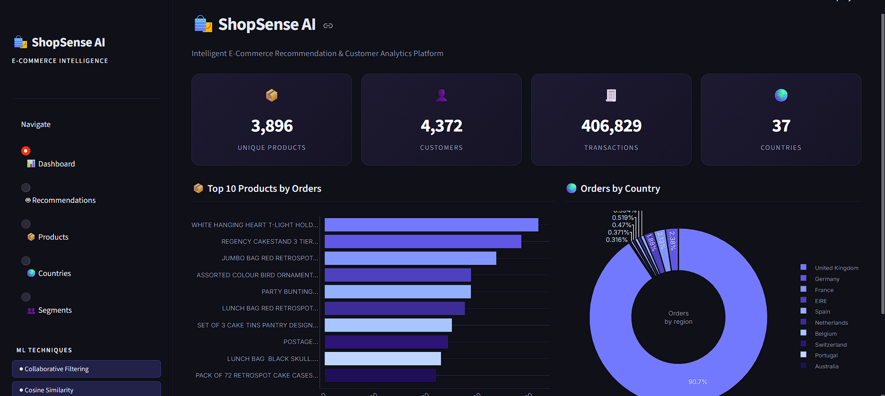
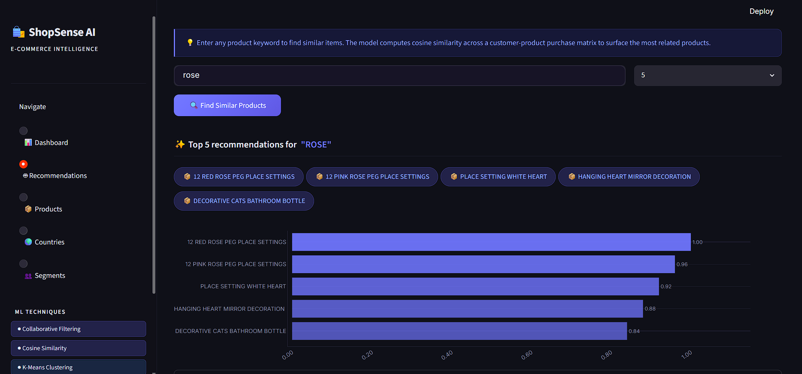
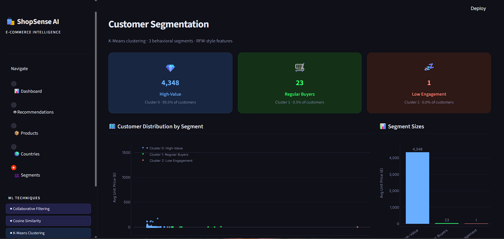

# 🛍️ ShopSense AI

Intelligent E-Commerce Recommendation & Customer Analytics Platform powered by Machine Learning.

## Overview

ShopSense AI is an end-to-end recommendation and analytics platform built using real-world retail transaction data. The system provides product recommendations using collaborative filtering and cosine similarity while also performing customer segmentation using K-Means clustering.

## Features

* Product Recommendation Engine
* Collaborative Filtering
* Cosine Similarity-Based Recommendations
* Customer Segmentation
* K-Means Clustering
* Interactive Analytics Dashboard
* Geographic Sales Analysis
* Product Performance Analytics

## Dataset

The project uses the UCI Online Retail Dataset containing:

* Customer purchase history
* Product information
* Transaction records
* Geographic purchase data

## Machine Learning Techniques

### Recommendation System

* Item-based Collaborative Filtering
* Cosine Similarity

### Customer Analytics

* K-Means Clustering
* Customer Segmentation

## Tech Stack

* Python
* Pandas
* NumPy
* Scikit-Learn
* Streamlit
* Plotly

## Dashboard Features

### Analytics Dashboard

* Product Statistics
* Customer Statistics
* Transaction Analytics
* Country-wise Insights

### Recommendation Engine

* Product Similarity Search
* Top-N Recommendations

### Customer Segmentation

* High-Value Customers
* Regular Buyers
* Low-Engagement Customers

## Screenshots

### Dashboard

### Recommendations

### Customer Segmentation

## Future Improvements

* Real-time Recommendation API
* Product Image Integration
* Deep Learning Recommendation Models
* Cloud Deployment

## Author

Ishan Khandal
